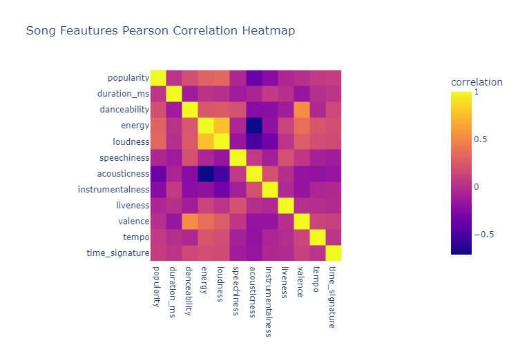
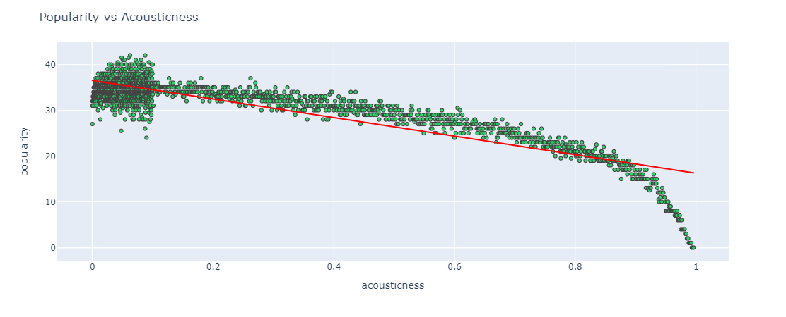
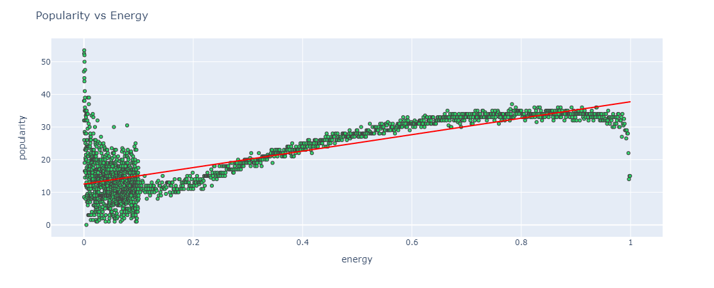
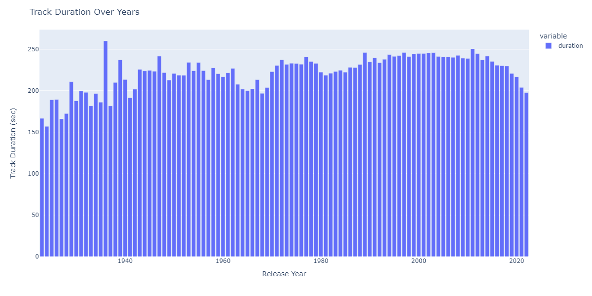
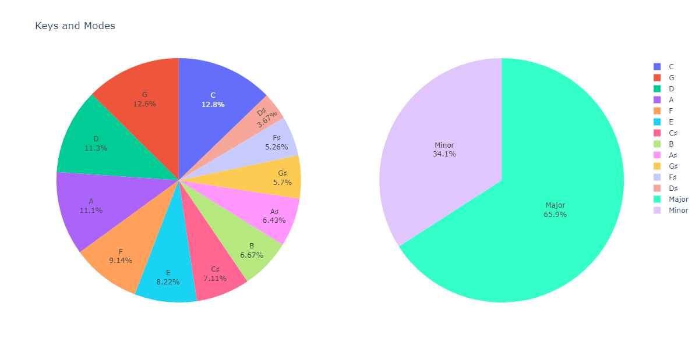
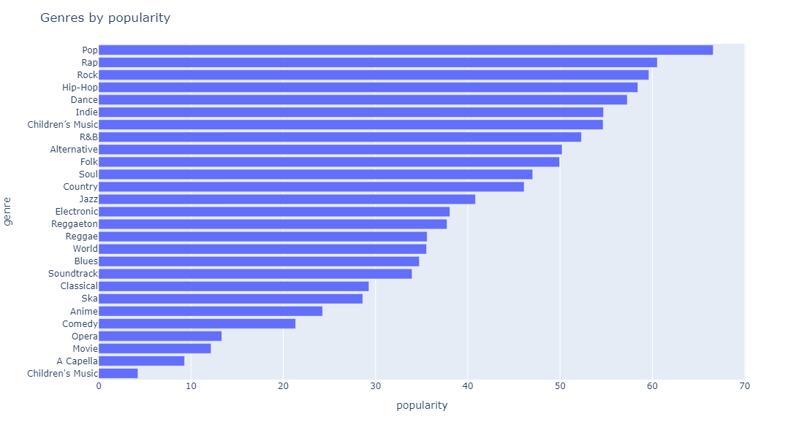
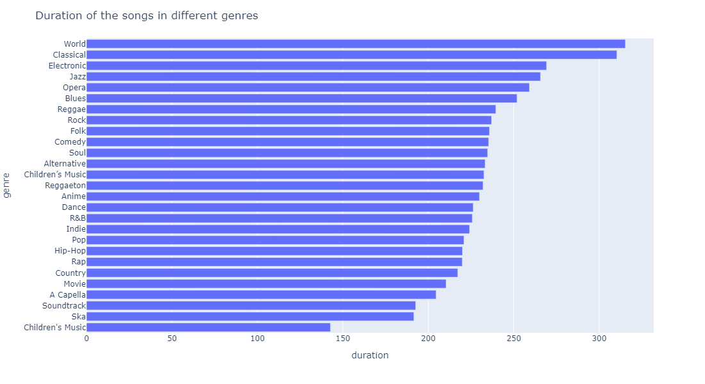

# Exploratory Data Analysis : Spotify

## Introduction

Spotify is a Swedish audio streaming and media services provider founded in April 2006. It is the world's largest music streaming service provider and has over 381 million monthly active users, which also includes 172 million paid subscribers. We'll exploring and quantify data about music and drawing valuable insights by plotting some graphs.

[Tracks Dataset](https://www.kaggle.com/datasets/lehaknarnauli/spotify-datasets?select=artists.csv) that contains over 500 thousand tracks
[Genre Dataset](https://www.kaggle.com/datasets/zaheenhamidani/ultimate-spotify-tracks-db) that contains over 250 thousand tracks with their genre

We have done the following steps in this EDA Task:

1. Reading and Analyzing the DataSet provided.
2. Plot different graphs
3. Exploring and Visualizing Data

## Prereqs (at least)

- Python version 3+
- pandas 1.4.3
- Matplotlib 3.5.1
- Numpy 1.23.2
- plotly 5.10.0

## Output Graphs

### Correlation Plot

### Popularity Vs Acousticness

### Popularity Vs Energy

### Number of Tracks over years

### Track Duration over Years

### Keys and Mode Pie Chart

### Genres by Popularity

### Duration of the songs in different genres

## Conclusions

1. Analyzed 500k+ tracks data which has 71 null values.
2. We observe that most of the values in columns are between 0 and 1, except duration_ms, loudness, popularity, tempo, time_singature and key.
3. Dataset had songs from over a century ranging from year 1922 to 2021.
4. Found out top 10 least popular songs on spotify.
5. Found out top 10 most popular songs on spotify.
6. Plotted pearson correlation heatmap to find correlation between different features of our data. Further analyzed correlation between popularity and energy and popularity and acousticness.
7. Popularity vs Acousticness graph showed low negative correlation. 0.05 is the sweet spot for popularity. It might be a slight indication that users are looking for more uplifting songs on Spotify, since increase in acousticness follows decrease in popularity.
8. Popularity vs Energy graph showed low positive correlation. While there are low energy songs that are not highly popular, high energy songs are almost always welcomed by listeners. However, these indications are insufficient for a definite conclusion.
9. The number of songs has gradually increased over the years, except for the 2000s when it fell for two decades and then rose again. This could be strictly related to the production numbers in those years.
10. On average, the duration of the tracks are around 3 to 4 minutes. Our data has the longest song which is 93mins long and the shortest song which is 3 seconds long only.
11. We have a major dominance on the mode and C-G-D-A are the most popular keys used in the songs.
12. Analyzed 250k+ tracks with genre data which has 0 null values.
13. Our dataset had a total of 27 unique genres.
14. After plotting the bar graph for genres by popularity we found out "Pop" is the most popular genre and "children's music" is the least popular genre.
15. After plotting the bar graph for genres by duration we found out that "World" genre songs are the longest while "children's music" genre songs are the shortest.
